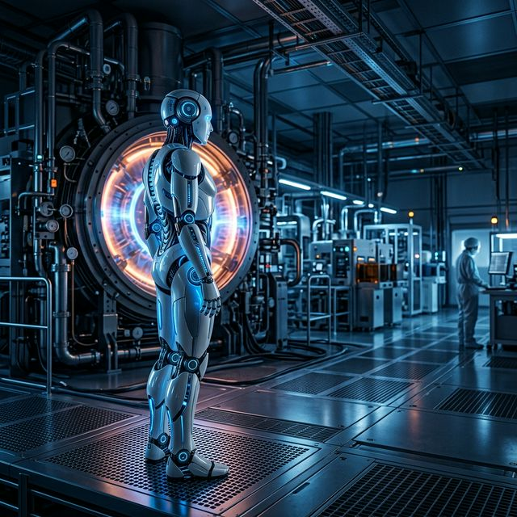

<!DOCTYPE html>
<html lang="ko">
<head>
    <meta charset="UTF-8">
    <meta name="viewport" content="width=device-width, initial-scale=1.0">
    <title>AMK Portfolio | The Physical AI Engineer</title>
    <link rel="stylesheet" href="style.css">
    <link rel="preconnect" href="https://fonts.googleapis.com">
    <link rel="preconnect" href="https://fonts.gstatic.com" crossorigin>
    <link href="https://fonts.googleapis.com/css2?family=Inter:wght@300;400;600;700&display=swap" rel="stylesheet">
    
    
    
</head>
<body>
    <!-- Premium UI Elements -->
    

        

    

    

    <nav class="glass-nav">
        

            
AMK PRC

            <ul class="nav-links">
                <li><a href="#innovation">혁신 기술</a></li>
                <li><a href="#mastery">전문성</a></li>
                <li><a href="#intelligence">지능형 유지보수</a></li>
                <li><a href="#competencies">기술 역량</a></li>
                <li><a href="#action">경험 및 실적</a></li>
                <li><a href="#board">자유 게시판</a></li>
                <li><a href="#contact">연락처</a></li>
            </ul>
        

    </nav>

    <main>
        <!-- Hero Section -->
        <section id="hero" class="v-section">
            

                <h1 class="reveal-text">피지컬 AI 에디션</h1>
                
옹스트롬 시대를 이끄는 어플라이드 머티어리얼즈 기반의 맞춤 공정 마스터

                

                    <a href="index.html">포트폴리오 라이브 링크</a>
                

                

                    <a href="#innovation" class="btn btn-primary">포트폴리오 탐색</a>
                    <a href="#board" class="btn btn-secondary"><i data-lucide="message-square" style="width:18px; margin-right:5px; vertical-align:middle;"></i> 자유 게시판</a>
                    <a href="mailto:1234@gmail.com" class="btn btn-outline" style="border: 1px solid rgba(255,255,255,0.3); padding: 0.8rem 1.5rem; border-radius: 50px; font-weight: 500; transition: all 0.3s;">전문가 상담</a>
                

                

                    
<i data-lucide="target"></i> 정밀도: 1Å

                    
<i data-lucide="cpu"></i> AI: 예측형 4.0

                    
<i data-lucide="settings"></i> 시스템: ALD/CVD

                

            

            

                

                    
                    

                

            

            <canvas id="particleCanvas" class="particle-network"></canvas>
            

                

                Scroll to Explore
            

        </section>

        <!-- Section 01: INNOVATION -->
        <section id="innovation" class="v-section">
            

                

                    01. 혁신 기술 (Innovation)
                    <h2>Atomic Layer Precision & Plasma Synergy</h2>
                    
<strong>반도체 공정 시뮬레이션 및 차세대 박막 증착 솔루션.</strong> Applied Materials의 핵심 플랫폼(Centura®, Olympia®)을 기반으로 원자 가속기 수준의 정밀한 가스 유량 제어와 RF 임피던스 매칭 최적화를 수행합니다. 단순한 장비 운용을 넘어 가스 펄싱 시퀀스의 마이크로초(μs) 단위 동기화를 통해 증착 속도와 균일도를 획기적으로 향상시킵니다. 특히 3D-NAND 및 FinFET 구조에서의 High-k 유전체 박막 형성 시 발생하는 극한의 종횡비(Aspect Ratio) 문제를 물리적 데이터 모델링을 통해 해결하는 초격차 기술력을 지향합니다.

                

                

                    
                    

                        
두께 제어: ±0.1Å

                        
Uniformity: 0.8% RMS

                        
Wafer Throughput: +22%

                    

                

            

        </section>

        <!-- Section 02: MASTERY -->
        <section id="mastery" class="v-section">
            

                

                    02. 전문성 (Mastery)
                    <h2>Cyber-Physical System Architecture</h2>
                    
<strong>고성능 PLC 및 실시간 통신망 통합 제어.</strong> 하드웨어의 물리적 한계를 극복하기 위해 Mitsubishi iQ-R 및 Rockwell Automation의 고성능 제어 엔진을 기반으로 한 지능형 자동화 아키텍처를 설계합니다. EtherCAT 프로토콜을 활용한 초저지연(Low-latency) 데이터 통신망을 구축하여 모터 제어와 센싱 피드백 간의 실시간 동기화를 구현합니다. 이는 장비의 유휴 시간을 제로에 가깝게 수렴시키며, 하드웨어 성능을 소프트웨어적 지능으로 극대화하는 '피지컬 AI'의 핵심 기반이 됩니다.

                

                

                    

                        
                        

                        

                    

                    

                        
CPU Cycle: 0.2ms

                        
Sync Jitter: < 1μs

                        
Uptime Score: 99.98%

                    

                

            

        </section>

        <!-- Section 03: INTELLIGENCE -->
        <section id="intelligence" class="v-section">
            

                

                    03. 지능형 유지보수 (Intelligence)
                    <h2>Cognitive Predictive Maintenance</h2>
                    
<strong>빅데이터 및 AI 기반의 자율 진단 시스템.</strong> Fault Detection and Classification (FDC) 시스템을 통해 수집되는 수만 가지의 센서 파라미터(온도, 압력, RF Phase 등)를 딥러닝 알고리즘으로 분석합니다. 단순 추세 분석을 넘어 챔버 내 부품의 물리적 마모도를 수치화하여, 예기치 못한 시스템 정지(Unplanned Down-time)를 사전에 방지하는 예지 보전 모델을 운영합니다. 이는 공정 변동성을 능동적으로 제어하고 전체 소유 비용(TCO)을 획기적으로 절감하는 지능형 제조 솔루션의 정점입니다.

                

                

                    
                    

                        
Anomaly Detection: Active

                        
Remaining Life: 352 Hours

                        
Model Accuracy: 98.4%

                    

                

            

        </section>

        <!-- Core Competencies -->
        <section id="competencies" class="v-section">
            

                핵심 역량 (Stack)
                <h2>Integrated Engineering Competencies</h2>
                

                    

                        

                            ALD/CVD Process Physics (Quantum Precision)
                            98%
                        

                        

                    

                    

                        

                            Advanced PLC Logic & Network Topology
                            94%
                        

                        

                    

                    

                        

                            ML-based Predictive Maintenance Modeling
                            88%
                        

                        

                    

                    

                        

                            Ultra High Vacuum & RF System Engineering
                            96%
                        

                        

                    

                

            

        </section>

        <!-- Section 04: ACTION -->
        <section id="action" class="v-section">
            

                

                    04. 경험 및 실적 (Action)
                    <h2>Proven Global Engineering Excellence</h2>
                    

                        

                            

                            <h3>AMK Technical Mastery Certification</h3>
                            
어플라이드 머티어리얼즈 코리아 교육 센터 최우수 수료 및 반도체 공정 장비 심화 기술 인증 획득 (Olympia/Centura Spec.)

                        

                        

                            

                            <h3>Process Yield Optimization Project (Lead)</h3>
                            
플라즈마 균일도 개선 알고리즘 적용으로 박막 수율 1.5% 향상 및 챔버 세정 주기 20% 연장 실현

                        

                        

                            

                            <h3>Global Collaboration & Communication</h3>
                            
Santa Clara 본사 엔지니어링 팀과의 주기적 기술 화상 회의 주도 및 기술 리포트 발간 (Eng. Spec V4.2 기반)

                        

                    

                

            

        </section>

        <!-- Section 05: FREE BOARD -->
        <section id="board" class="v-section">
            

                

                    05. BOARD
                    <h2>자유 게시판 (방명록)</h2>
                    
이 게시판은 데이터베이스 없이 여러분의 브라우저 <b>로컬 스토리지(Local Storage)</b>를 사용하여 동작합니다. 등록된 글은 현재 사용 중인 기기의 브라우저에만 저장되며 새로고침해도 유지됩니다. 질문, 요청, 관련 정보를 자유롭게 남기고 답글도 달아보세요!

                    
                    

                        <button id="btnShowWrite" class="btn btn-primary" onclick="toggleWriteForm()"><i data-lucide="pen-square"></i> 글쓰기</button>
                        <a href="#hero" class="btn btn-secondary" style="margin-left: 0;"><i data-lucide="home"></i> 홈으로</a>
                    

                

                
                

                    

                        <h3 id="formTitle">새 글 쓰기</h3>
                        <form id="boardForm" class="board-form" onsubmit="submitBoard(event)">
                            <input type="hidden" id="editPostId" value="">
                            

                                <input type="text" id="boardName" required placeholder="이름 (Name)">
                                <input type="email" id="boardEmail" required placeholder="이메일 (Email)">
                            

                            <textarea id="boardContent" rows="4" required placeholder="공유하고 싶은 정보나 질문을 요약해 주세요..."></textarea>
                            

                                <button type="submit" id="btnSubmitPost" class="btn btn-primary" style="flex: 1; font-size: 1rem; padding: 0.8rem 2rem;">게시글 등록</button>
                                <button type="button" class="btn btn-secondary" onclick="toggleWriteForm()" style="flex: 0.5; margin-left: 0;">취소</button>
                            

                        </form>
                    

                    
                    

                        <!-- Posts will be rendered here via JS -->
                    

                

            

        </section>

        <!-- Section 06: CONTACT -->
        <section id="contact" class="v-section">
            

                

                    06. 연락처
                    <h2>문의하기</h2>
                    
아래 양식을 작성해 주시면 담당자 이메일로 즉시 메시지가 전송됩니다.

                

                
                

                    <!-- mailto: 자신의 이메일 주소로 변경하여 사용하세요 -->
                    <form id="contactForm" class="glass-form" onsubmit="sendEmail(event)">
                        

                            <label for="name">이름 (Name)</label>
                            <input type="text" id="contactName" required placeholder="이름을 입력하세요">
                        

                        

                            <label for="email">이메일 (Email)</label>
                            <input type="email" id="contactEmail" required placeholder="이메일 주소를 입력하세요">
                        

                        

                            <label for="message">내용 (Message)</label>
                            <textarea id="contactMessage" rows="5" required placeholder="문의하실 내용을 입력하세요"></textarea>
                        

                        <button type="submit" class="btn btn-primary submit-btn">메시지 보내기</button>
                    </form>
                

            

        </section>
    </main>

    <footer class="glass-footer">
        

            
<i data-lucide="mail"></i> 1234@gmail.com

            
<i data-lucide="phone"></i> 010-1234-5678

        

        
&copy; 2026 Applied Materials Korea Portfolio. Built by Antigravity.

    </footer>

    
    
</body>
</html>

// Initialize GSAP
gsap.registerPlugin(ScrollTrigger);

// Hero Animations
gsap.from(".reveal-text", {
    y: 100,
    opacity: 0,
    duration: 1.2,
    ease: "power4.out"
});

gsap.from(".fade-in", {
    opacity: 0,
    y: 20,
    stagger: 0.2,
    duration: 1,
    delay: 0.5,
    ease: "power3.out"
});

// Section Parallax & Reveals
const sections = document.querySelectorAll('.v-section');

sections.forEach((section) => {
    const title = section.querySelector('h2');
    const content = section.querySelector('p');
    const visual = section.querySelector('.visual-box');
    
    if (title) {
        gsap.from(title, {
            scrollTrigger: {
                trigger: section,
                start: "top 80%",
            },
            x: -50,
            opacity: 0,
            duration: 1,
            ease: "power2.out"
        });
    }

    if (content) {
        gsap.from(content, {
            scrollTrigger: {
                trigger: section,
                start: "top 75%",
            },
            y: 30,
            opacity: 0,
            duration: 1,
            delay: 0.2,
            ease: "power2.out"
        });
    }

    if (visual) {
        gsap.from(visual, {
            scrollTrigger: {
                trigger: section,
                start: "top 70%",
                onEnter: () => {
                    const mask = visual.querySelector('.reveal-mask');
                    if (mask) mask.classList.add('active');
                }
            },
            scale: 0.9,
            opacity: 0,
            duration: 1.5,
            ease: "expo.out"
        });
    }
});

// Particle Network Background (Grand Aesthetic)
const canvas = document.getElementById('particleCanvas');
const cursor = document.querySelector('.cursor-follower');
const scrollBar = document.getElementById('scrollBar');

if (canvas) {
    const ctx = canvas.getContext('2d');
    let particles = [];
    let mouse = { x: null, y: null };
    
    function resize() {
        canvas.width = window.innerWidth;
        const heroSection = document.getElementById('hero');
        canvas.height = heroSection ? heroSection.offsetHeight : window.innerHeight;
    }
    
    window.addEventListener('resize', resize);
    window.addEventListener('mousemove', (e) => {
        mouse.x = e.clientX;
        mouse.y = e.clientY;
        
        // Update Custom Cursor
        if (cursor) {
            cursor.style.left = e.clientX + 'px';
            cursor.style.top = e.clientY + 'px';
        }
    });

    window.addEventListener('mousedown', () => cursor && cursor.classList.add('active'));
    window.addEventListener('mouseup', () => cursor && cursor.classList.remove('active'));

    // Scroll Progress
    window.addEventListener('scroll', () => {
        const winScroll = document.body.scrollTop || document.documentElement.scrollTop;
        const height = document.documentElement.scrollHeight - document.documentElement.clientHeight;
        const scrolled = (winScroll / height) * 100;
        if (scrollBar) scrollBar.style.width = scrolled + "%";
    });
    
    resize();
    
    class Particle {
        constructor() {
            this.x = Math.random() * canvas.width;
            this.y = Math.random() * canvas.height;
            this.vx = (Math.random() - 0.5) * 1.5;
            this.vy = (Math.random() - 0.5) * 1.5;
            this.radius = Math.random() * 2 + 1;
        }
        
        update() {
            this.x += this.vx;
            this.y += this.vy;
            
            if (this.x < 0 || this.x > canvas.width) this.vx *= -1;
            if (this.y < 0 || this.y > canvas.height) this.vy *= -1;

            // Mouse interaction
            if (mouse.x != null) {
                const dx = mouse.x - this.x;
                const dy = mouse.y - this.y;
                const dist = Math.sqrt(dx*dx + dy*dy);
                if (dist < 100) {
                    this.x -= dx * 0.05;
                    this.y -= dy * 0.05;
                }
            }
        }
        
        draw() {
            ctx.beginPath();
            ctx.arc(this.x, this.y, this.radius, 0, Math.PI * 2);
            ctx.fillStyle = 'rgba(14, 165, 233, 0.6)';
            ctx.fill();
        }
    }
    
    for (let i = 0; i < 80; i++) {
        particles.push(new Particle());
    }
    
    function animate() {
        ctx.clearRect(0, 0, canvas.width, canvas.height);
        
        for (let i = 0; i < particles.length; i++) {
            particles[i].update();
            particles[i].draw();
            
            for (let j = i; j < particles.length; j++) {
                const dx = particles[i].x - particles[j].x;
                const dy = particles[i].y - particles[j].y;
                const distance = Math.sqrt(dx * dx + dy * dy);
                
                if (distance < 150) {
                    ctx.beginPath();
                    ctx.strokeStyle = `rgba(14, 165, 233, ${(1 - distance / 150) * 0.5})`;
                    ctx.lineWidth = 1;
                    ctx.moveTo(particles[i].x, particles[i].y);
                    ctx.lineTo(particles[j].x, particles[j].y);
                    ctx.stroke();
                }
            }
        }
        requestAnimationFrame(animate);
    }
    
    animate();
}

// Hero Robot Parallax
const heroVisual = document.querySelector('.hero-visual');
if (heroVisual) {
    document.addEventListener('mousemove', (e) => {
        const x = (e.clientX - window.innerWidth / 2) / 50;
        const y = (e.clientY - window.innerHeight / 2) / 50;
        
        gsap.to(heroVisual, {
            x: x,
            y: y,
            duration: 1,
            ease: "power2.out"
        });
    });
}

// Hover effect for Mastery Section
const explodedView = document.querySelector('.exploded-view');
if (explodedView) {
    explodedView.addEventListener('mousemove', (e) => {
        const { left, top, width, height } = explodedView.getBoundingClientRect();
        const x = (e.clientX - left) / width - 0.5;
        const y = (e.clientY - top) / height - 0.5;
        
        gsap.to(explodedView.querySelector('img'), {
            rotateY: x * 10,
            rotateX: -y * 10,
            duration: 0.5,
            ease: "power2.out"
        });
    });
    
    explodedView.addEventListener('mouseleave', () => {
        gsap.to(explodedView.querySelector('img'), {
            rotateY: 0,
            rotateX: 0,
            duration: 1,
            ease: "elastic.out(1, 0.3)"
        });
    });
}

// Nav backdrop on scroll
ScrollTrigger.create({
    start: "top -80",
    onUpdate: (self) => {
        const nav = document.querySelector('.glass-nav');
        if (self.direction === 1) {
            gsap.to(nav, { y: -100, duration: 0.3 });
        } else {
            gsap.to(nav, { y: 0, opacity: 1, duration: 0.3, background: "rgba(2, 6, 23, 0.8)" });
        }
    }
});

// Skill Bars Animation
const skillBars = document.querySelectorAll('.skill-progress');
skillBars.forEach((bar) => {
    gsap.from(bar, {
        scrollTrigger: {
            trigger: bar,
            start: "top 90%",
        },
        width: 0,
        duration: 2,
        ease: "power4.out"
    });
});

// --- Free Board LocalStorage Logic ---
const STORAGE_KEY = 'amk_board_posts';

// Global access functions
window.toggleWriteForm = function() {
    const boardFormContainer = document.getElementById('boardFormContainer');
    const boardForm = document.getElementById('boardForm');
    const editPostId = document.getElementById('editPostId');
    const formTitle = document.getElementById('formTitle');
    const btnSubmitPost = document.getElementById('btnSubmitPost');

    if (!boardFormContainer) return;
    
    // Check current display via computed style if needed, but simpler:
    const isHidden = boardFormContainer.style.display === 'none' || boardFormContainer.style.display === '';
    
    if (isHidden) {
        boardFormContainer.style.display = 'block';
        if (boardForm) boardForm.reset();
        if (editPostId) editPostId.value = '';
        if (formTitle) formTitle.textContent = '새 글 쓰기';
        if (btnSubmitPost) btnSubmitPost.textContent = '게시글 등록';
        boardFormContainer.scrollIntoView({ behavior: 'smooth' });
    } else {
        boardFormContainer.style.display = 'none';
    }
};

window.editPost = function(id) {
    const posts = JSON.parse(localStorage.getItem(STORAGE_KEY)) || [];
    const post = posts.find(p => p.id === id);
    if (!post) return;
    
    const boardFormContainer = document.getElementById('boardFormContainer');
    const editPostId = document.getElementById('editPostId');
    const formTitle = document.getElementById('formTitle');
    const btnSubmitPost = document.getElementById('btnSubmitPost');

    if (boardFormContainer) boardFormContainer.style.display = 'block';
    
    document.getElementById('boardName').value = post.name;
    document.getElementById('boardEmail').value = post.email;
    document.getElementById('boardContent').value = post.content;
    if (editPostId) editPostId.value = post.id;
    
    if (formTitle) formTitle.textContent = '게시글 수정하기';
    if (btnSubmitPost) btnSubmitPost.textContent = '수정 완료';
    
    if (boardFormContainer) boardFormContainer.scrollIntoView({ behavior: 'smooth' });
};

window.deletePost = function(id) {
    if (!confirm('정말로 이 게시글을 삭제하시겠습니까?')) return;
    let posts = JSON.parse(localStorage.getItem(STORAGE_KEY)) || [];
    posts = posts.filter(p => p.id !== id);
    localStorage.setItem(STORAGE_KEY, JSON.stringify(posts));
    renderPosts(posts);
};

window.addReply = function(e, postId) {
    e.preventDefault();
    const form = e.target;
    if (!form) return;

    const nameVal = form.replyName ? form.replyName.value.trim() : '';
    const contentVal = form.replyContent ? form.replyContent.value.trim() : '';
    
    if (!nameVal || !contentVal) return;
    
    const posts = JSON.parse(localStorage.getItem(STORAGE_KEY)) || [];
    const postIndex = posts.findIndex(p => p.id === postId);
    
    if (postIndex !== -1) {
        if (!posts[postIndex].replies) posts[postIndex].replies = [];
        posts[postIndex].replies.push({
            name: nameVal,
            content: contentVal,
            date: new Date().toISOString()
        });
        localStorage.setItem(STORAGE_KEY, JSON.stringify(posts));
        renderPosts(posts);
    }
    form.reset();
};

function renderPosts(posts) {
    const boardList = document.getElementById('boardList');
    if (!boardList) return;
    boardList.innerHTML = '';
    
    if (posts.length === 0) {
        boardList.innerHTML = '
아직 등록된 게시글이 없습니다. 첫 글을 남겨보세요!
';
        return;
    }
    
    posts.slice().reverse().forEach(post => {
        const postEl = document.createElement('div');
        postEl.className = 'post-item';
        
        let repliesHtml = '';
        if (post.replies && post.replies.length > 0) {
            repliesHtml = `
`;
            post.replies.forEach(reply => {
                repliesHtml += `
                    

                        

                            <strong>${escapeHTML(reply.name)}</strong>
                            ${formatDate(reply.date)}
                        

                        
${escapeHTML(reply.content)}

                    

                `;
            });
            repliesHtml += `
`;
        }
        
        postEl.innerHTML = `
            

                
<strong>${escapeHTML(post.name)}</strong> ${escapeHTML(post.email)}

                

                    

                        <button class="action-btn" onclick="editPost('${post.id}')"><i data-lucide="edit-3" style="width:14px;"></i> 수정</button>
                        <button class="action-btn delete" onclick="deletePost('${post.id}')"><i data-lucide="trash-2" style="width:14px;"></i> 삭제</button>
                    

                    ${formatDate(post.date)}
                

            

            
${escapeHTML(post.content)}

            ${repliesHtml}
            <form class="reply-form" onsubmit="addReply(event, '${post.id}')">
                <input type="text" name="replyName" placeholder="답글 작성자" required>
                <input type="text" name="replyContent" placeholder="답글 내용" required style="flex: 2 1 300px;">
                <button type="submit">답글 달기</button>
            </form>
        `;
        boardList.appendChild(postEl);
    });
    
    if (window.lucide) window.lucide.createIcons();
}

function escapeHTML(str) {
    if (!str) return '';
    return str.replace(/[&<>'"]/g, tag => ({
        '&': '&amp;', '<': '&lt;', '>': '&gt;', "'": '&#39;', '"': '&quot;'
    }[tag] || tag));
}

function formatDate(dateString) {
    const d = new Date(dateString);
    return `${d.getFullYear()}.${String(d.getMonth()+1).padStart(2,'0')}.${String(d.getDate()).padStart(2,'0')} ${String(d.getHours()).padStart(2,'0')}:${String(d.getMinutes()).padStart(2,'0')}`;
}

// Handle Form Submit (Both Create and Update)
window.submitBoard = function(e) {
    if (e) e.preventDefault();
    
    const boardForm = document.getElementById('boardForm');
    const nameVal = document.getElementById('boardName').value.trim();
    const emailVal = document.getElementById('boardEmail').value.trim();
    const contentVal = document.getElementById('boardContent').value.trim();
    const idVal = document.getElementById('editPostId') ? document.getElementById('editPostId').value : '';
    
    if (!nameVal || !emailVal || !contentVal) {
        alert('이름, 이메일, 내용을 모두 입력해 주세요.');
        return;
    }
    
    let posts = JSON.parse(localStorage.getItem(STORAGE_KEY)) || [];
    if (idVal) {
        const idx = posts.findIndex(p => p.id === idVal);
        if (idx !== -1) {
            posts[idx].name = nameVal;
            posts[idx].email = emailVal;
            posts[idx].content = contentVal;
            posts[idx].date = new Date().toISOString();
        }
    } else {
        posts.push({
            id: '_' + Math.random().toString(36).substr(2, 9),
            name: nameVal,
            email: emailVal,
            content: contentVal,
            date: new Date().toISOString(),
            replies: []
        });
    }
    
    localStorage.setItem(STORAGE_KEY, JSON.stringify(posts));
    renderPosts(posts);
    if (boardForm) boardForm.reset();
    window.toggleWriteForm(); // Hide form after submission
};

// Initial Load
document.addEventListener('DOMContentLoaded', () => {
    const initialPosts = JSON.parse(localStorage.getItem(STORAGE_KEY)) || [];
    renderPosts(initialPosts);
});

window.sendEmail = function(e) {
    e.preventDefault();
    const name = document.getElementById('contactName').value;
    const email = document.getElementById('contactEmail').value;
    const message = document.getElementById('contactMessage').value;
    if (!name || !email || !message) {
        alert('모든 양식을 작성해 주세요.');
        return;
    }

    const subject = encodeURIComponent(`[문의] 피지컬 AI 포트폴리오 상담 요청 - ${name}`);
    const body = encodeURIComponent(`보낸 사람: ${name}\n이메일: ${email}\n\n내용:\n${message}`);
    
    const mailtoUrl = `mailto:1234@gmail.com?subject=${subject}&body=${body}`;
    window.location.href = mailtoUrl;
};

:root {
    --bg-dark: #020617;
    --amk-blue: #001F3F;
    --amk-blue-light: #0ea5e9;
    --amk-neon: #38bdf8;
    --text-white: #f8fafc;
    --text-gray: #94a3b8;
    --silver: #cbd5e1;
    --glass: rgba(15, 23, 42, 0.7);
    --glass-border: rgba(56, 189, 248, 0.2);
}

* {
    margin: 0;
    padding: 0;
    box-sizing: border-box;
}

body {
    font-family: 'Inter', sans-serif;
    background-color: var(--bg-dark);
    color: var(--text-white);
    line-height: 1.6;
    overflow-x: hidden;
    cursor: none; /* For custom cursor */
}

/* Scroll Progress Bar */
.scroll-progress-container {
    position: fixed;
    top: 0;
    left: 0;
    width: 100%;
    height: 4px;
    z-index: 2000;
    background: transparent;
}

#scrollBar {
    height: 100%;
    background: linear-gradient(to right, var(--amk-blue-light), var(--amk-neon));
    width: 0%;
    box-shadow: 0 0 15px var(--amk-neon);
}

/* Custom Cursor */
.cursor-follower {
    position: fixed;
    width: 20px;
    height: 20px;
    background: rgba(14, 165, 233, 0.3);
    border: 2px solid var(--amk-neon);
    border-radius: 50%;
    pointer-events: none;
    z-index: 10000;
    transform: translate(-50%, -50%);
    transition: transform 0.1s ease-out, width 0.3s, height 0.3s, background 0.3s;
    box-shadow: 0 0 20px var(--amk-blue-light);
}

.cursor-follower.active {
    width: 40px;
    height: 40px;
    background: rgba(14, 165, 233, 0.1);
}

/* Glassmorphism Navigation */
.glass-nav {
    position: fixed;
    top: 0;
    width: 100%;
    z-index: 1000;
    background: rgba(2, 6, 23, 0.6);
    backdrop-filter: saturate(180%) blur(20px);
    border-bottom: 1px solid rgba(255, 255, 255, 0.08);
    padding: 1rem 0;
    transition: all 0.4s ease;
}

.nav-container {
    max-width: 1200px;
    margin: 0 auto;
    display: flex;
    justify-content: space-between;
    align-items: center;
    padding: 0 2rem;
}

.logo {
    font-weight: 700;
    font-size: 1.5rem;
    letter-spacing: 2px;
}

.logo span {
    color: var(--amk-blue-light);
}

.nav-links {
    list-style: none;
    display: flex;
    gap: 3rem;
}

.nav-links a {
    text-decoration: none;
    color: var(--text-gray);
    font-weight: 500;
    transition: color 0.3s;
    font-size: 0.9rem;
}

.nav-links a:hover {
    color: var(--text-white);
}

/* Sections */
.v-section {
    min-height: 100vh;
    display: flex;
    align-items: center;
    padding: 5rem 2rem;
    position: relative;
    border-bottom: 1px solid rgba(255, 255, 255, 0.05);
}

.container {
    max-width: 1200px;
    margin: 0 auto;
    width: 100%;
}

.grid {
    display: grid;
    grid-template-columns: 1fr 1.2fr;
    gap: 4rem;
    align-items: center;
}

.grid.invert {
    grid-template-columns: 1.2fr 1fr;
}

/* Hero */
#hero {
    background: radial-gradient(circle at 50% 50%, rgba(0, 31, 63, 0.8) 0%, #020617 100%);
    display: flex;
    flex-direction: column;
    justify-content: center;
    align-items: center;
    padding-top: 8rem;
    position: relative;
}

.particle-network {
    position: absolute;
    top: 0;
    left: 0;
    width: 100%;
    height: 100%;
    pointer-events: none;
    z-index: 1;
}

.hero-visual {
    margin-top: 2rem;
    width: 100%;
    max-width: 600px;
    z-index: 5;
}

.floating-robot {
    width: 100%;
    height: auto;
    filter: drop-shadow(0 20px 50px rgba(14, 165, 233, 0.3));
    animation: float 6s ease-in-out infinite;
}

@keyframes float {
    0%, 100% { transform: translateY(0) rotate(0); }
    50% { transform: translateY(-30px) rotate(2deg); }
}

.hero-specs {
    margin-top: 3rem;
    display: flex;
    justify-content: center;
    gap: 2rem;
    z-index: 10;
}

.spec-item {
    display: flex;
    align-items: center;
    gap: 0.5rem;
    font-size: 0.85rem;
    color: var(--amk-blue-light);
    font-family: monospace;
    background: rgba(14, 165, 233, 0.1);
    padding: 0.5rem 1rem;
    border-radius: 8px;
    border: 1px solid rgba(14, 165, 233, 0.3);
    backdrop-filter: blur(5px);
}

.spec-item i {
    width: 16px;
    height: 16px;
}

.scan-container {
    position: relative;
    overflow: hidden;
    border-radius: 20px;
}

.scan-line {
    position: absolute;
    top: 0;
    left: 0;
    width: 100%;
    height: 2px;
    background: linear-gradient(to right, transparent, var(--amk-blue-light), transparent);
    box-shadow: 0 0 15px var(--amk-blue-light);
    animation: scan 3s linear infinite;
    z-index: 10;
}

@keyframes scan {
    0% { top: 0; }
    100% { top: 100%; }
}

.scroll-indicator {
    position: absolute;
    bottom: 2rem;
    display: flex;
    flex-direction: column;
    align-items: center;
    gap: 0.5rem;
    color: var(--text-gray);
    font-size: 0.75rem;
}

.mouse {
    width: 20px;
    height: 35px;
    border: 2px solid var(--text-gray);
    border-radius: 20px;
    position: relative;
}

.mouse::before {
    content: '';
    position: absolute;
    top: 6px;
    left: 50%;
    transform: translateX(-50%);
    width: 4px;
    height: 8px;
    background: var(--amk-blue-light);
    border-radius: 2px;
    animation: scroll 2s infinite;
}

@keyframes scroll {
    0% { opacity: 1; transform: translate(-50%, 0); }
    100% { opacity: 0; transform: translate(-50%, 20px); }
}

.hero-content h1 {
    font-size: 5.5rem;
    font-weight: 850;
    letter-spacing: -4px;
    margin-bottom: 0.5rem;
    background: linear-gradient(135deg, #ffffff 0%, #cbd5e1 50%, var(--amk-blue-light) 100%);
    -webkit-background-clip: text;
    background-clip: text;
    -webkit-text-fill-color: transparent;
    line-height: 1.1;
    position: relative;
    z-index: 10;
    text-shadow: 0 0 40px rgba(14, 165, 233, 0.3);
    animation: glow-pulse 3s infinite alternate;
}

@keyframes glow-pulse {
    from { text-shadow: 0 0 40px rgba(14, 165, 233, 0.3); }
    to { text-shadow: 0 0 60px rgba(14, 165, 233, 0.6), 0 0 20px rgba(255, 255, 255, 0.2); }
}

.subtitle {
    font-size: 1.4rem;
    color: var(--text-gray);
    margin-bottom: 2.5rem;
    letter-spacing: -0.5px;
    font-weight: 300;
}

/* Components */
.label {
    display: inline-block;
    color: var(--amk-blue-light);
    font-weight: 700;
    letter-spacing: 3px;
    margin-bottom: 1.2rem;
    font-size: 0.85rem;
    text-transform: uppercase;
}

h2 {
    font-size: 3.5rem;
    margin-bottom: 1.5rem;
    letter-spacing: -1.5px;
    font-weight: 700;
}

p {
    color: var(--text-gray);
    font-size: 1.05rem;
    max-width: 600px;
    line-height: 1.8;
    letter-spacing: -0.2px;
}

.visual-box {
    position: relative;
    overflow: hidden;
    border-radius: 20px;
}

.visual-box img {
    width: 100%;
    border-radius: 20px;
    box-shadow: 0 25px 50px -12px rgba(0, 0, 0, 0.5);
    transition: transform 0.5s cubic-bezier(0.4, 0, 0.2, 1);
}

.visual-box:hover img {
    transform: scale(1.05);
}

/* HUD Overlay */
.hud-overlay {
    position: absolute;
    top: 0;
    left: 0;
    width: 100%;
    height: 100%;
    padding: 2rem;
    background: linear-gradient(135deg, rgba(14, 165, 233, 0.1) 0%, rgba(0, 0, 0, 0) 100%);
    display: flex;
    flex-direction: column;
    justify-content: flex-end;
    align-items: flex-start;
    gap: 1rem;
    opacity: 0;
    transition: all 0.5s ease;
    pointer-events: none;
    border: 1px solid rgba(14, 165, 233, 0);
}

.visual-box:hover .hud-overlay {
    opacity: 1;
    border: 1px solid rgba(14, 165, 233, 0.3);
    backdrop-filter: blur(2px);
}

.hud-item {
    background: rgba(15, 23, 42, 0.8);
    border-left: 3px solid var(--amk-blue-light);
    color: var(--amk-blue-light);
    padding: 0.5rem 1rem;
    font-size: 0.8rem;
    font-family: monospace;
    letter-spacing: 1px;
    transform: translateX(-20px);
    transition: transform 0.4s ease;
}

.visual-box:hover .hud-item {
    transform: translateX(0);
}

.visual-box:hover .hud-item:nth-child(2) { transition-delay: 0.1s; }
.visual-box:hover .hud-item:nth-child(3) { transition-delay: 0.2s; }

/* Timeline */
.timeline {
    margin-top: 4rem;
    position: relative;
    padding-left: 2rem;
    border-left: 1px solid rgba(255, 255, 255, 0.1);
}

.timeline-item {
    margin-bottom: 3rem;
    position: relative;
}

.dot {
    position: absolute;
    left: -2.4rem;
    top: 5px;
    width: 12px;
    height: 12px;
    background: var(--amk-blue-light);
    border-radius: 50%;
    box-shadow: 0 0 10px var(--amk-blue-light);
}

/* Hotspots */
.exploded-view {
    position: relative;
}

.hotspot {
    position: absolute;
    width: 20px;
    height: 20px;
    background: rgba(14, 165, 233, 0.5);
    border-radius: 50%;
    cursor: pointer;
    animation: pulse 2s infinite;
}

.hotspot::after {
    content: attr(data-tip);
    position: absolute;
    bottom: 120%;
    left: 50%;
    transform: translateX(-50%);
    background: var(--amk-blue-light);
    color: white;
    padding: 0.5rem 1rem;
    border-radius: 4px;
    font-size: 0.75rem;
    white-space: nowrap;
    opacity: 0;
    visibility: hidden;
    transition: all 0.3s;
    pointer-events: none;
}

.hotspot:hover::after {
    opacity: 1;
    visibility: visible;
    bottom: 140%;
}

.reveal-mask {
    clip-path: inset(0 100% 0 0);
    transition: clip-path 1.5s cubic-bezier(0.77, 0, 0.175, 1);
}

.reveal-mask.active {
    clip-path: inset(0 0 0 0);
}

@keyframes pulse {
    0% { transform: scale(1); opacity: 1; }
    100% { transform: scale(2.5); opacity: 0; }
}

footer {
    text-align: center;
    padding: 3rem;
    color: var(--text-gray);
    font-size: 0.8rem;
    border-top: 1px solid rgba(255, 255, 255, 0.05);
}

/* Buttons */
.btn {
    display: inline-block;
    padding: 1rem 2rem;
    border-radius: 50px;
    text-decoration: none;
    font-weight: 600;
    transition: all 0.4s cubic-bezier(0.175, 0.885, 0.32, 1.275);
    position: relative;
    z-index: 50;
    overflow: hidden;
}

.btn::after {
    content: '';
    position: absolute;
    top: -50%;
    left: -50%;
    width: 200%;
    height: 200%;
    background: radial-gradient(circle, rgba(255,255,255,0.2) 0%, transparent 60%);
    opacity: 0;
    transform: scale(0.5);
    transition: all 0.4s;
    pointer-events: none;
}

.btn:hover::after {
    opacity: 1;
    transform: scale(1);
    top: -20%;
    left: -20%;
}

.btn-primary {
    background: linear-gradient(135deg, var(--amk-blue-light) 0%, #0369a1 100%);
    color: white;
    box-shadow: 0 4px 20px rgba(14, 165, 233, 0.3), inset 0 0 10px rgba(255,255,255,0.2);
    border: 1px solid rgba(255, 255, 255, 0.2);
}

.btn-secondary {
    border: 1px solid var(--amk-blue-light);
    color: var(--amk-blue-light);
    margin-left: 1rem;
    background: rgba(14, 165, 233, 0.05);
}

.btn-secondary:hover {
    background: rgba(14, 165, 233, 0.2);
    transform: translateY(-4px);
    box-shadow: 0 8px 25px rgba(14, 165, 233, 0.2);
    border-color: var(--amk-neon);
    color: white;
}

.btn-primary:hover {
    transform: translateY(-4px) scale(1.02);
    box-shadow: 0 15px 35px rgba(14, 165, 233, 0.5), inset 0 0 15px rgba(255,255,255,0.4);
    filter: brightness(1.15);
}

/* Skills Grid */
.skills-grid {
    display: grid;
    grid-template-columns: repeat(auto-fit, minmax(400px, 1fr));
    gap: 2rem;
    margin-top: 3rem;
}

.skill-item {
    background: rgba(255, 255, 255, 0.03);
    padding: 1.5rem;
    border-radius: 12px;
    border: 1px solid rgba(255, 255, 255, 0.05);
}

.skill-info {
    display: flex;
    justify-content: space-between;
    margin-bottom: 0.75rem;
    font-weight: 600;
    font-size: 0.9rem;
}

.skill-bar {
    width: 100%;
    height: 6px;
    background: rgba(255, 255, 255, 0.1);
    border-radius: 3px;
    overflow: hidden;
}

.skill-progress {
    height: 100%;
    background: linear-gradient(to right, var(--amk-blue-light), #38bdf8);
    box-shadow: 0 0 10px var(--amk-blue-light);
    border-radius: 3px;
}

@media (max-width: 768px) {
    .grid { grid-template-columns: 1fr; }
    .hero-content h1 { font-size: 3rem; }
    .nav-links { display: none; }
    .glass-form { padding: 1.5rem; }
}

/* Contact Form */
.contact-form-container {
    max-width: 600px;
    margin: 0 auto;
}

.glass-form {
    background: rgba(15, 23, 42, 0.6);
    padding: 2.5rem;
    border-radius: 20px;
    border: 1px solid var(--glass-border);
    backdrop-filter: blur(16px);
    -webkit-backdrop-filter: blur(16px);
    box-shadow: 0 20px 50px rgba(0, 0, 0, 0.5), inset 0 0 20px rgba(14, 165, 233, 0.05);
    position: relative;
    z-index: 50;
}

.form-group {
    margin-bottom: 1.5rem;
    text-align: left;
}

.form-group label {
    display: block;
    margin-bottom: 0.5rem;
    color: var(--text-gray);
    font-size: 0.9rem;
    font-weight: 500;
}

.form-group input,
.form-group textarea {
    width: 100%;
    padding: 1rem;
    background: rgba(15, 23, 42, 0.5);
    border: 1px solid rgba(255, 255, 255, 0.1);
    border-radius: 10px;
    color: var(--text-white);
    font-family: inherit;
    font-size: 1rem;
    transition: all 0.3s ease;
}

.form-group input::placeholder,
.form-group textarea::placeholder {
    color: rgba(148, 163, 184, 0.5);
}

.form-group input:focus,
.form-group textarea:focus {
    outline: none;
    border-color: var(--amk-blue-light);
    box-shadow: 0 0 15px rgba(14, 165, 233, 0.2);
    background: rgba(15, 23, 42, 0.8);
}

.submit-btn {
    width: 100%;
    margin-top: 1rem;
    cursor: pointer;
    font-size: 1.1rem;
}

/* Free Board */
.board-container {
    max-width: 800px;
    margin: 0 auto;
    position: relative;
    z-index: 50;
}

.board-post-form {
    margin-bottom: 3rem;
    padding-bottom: 2rem;
    border-bottom: 1px solid rgba(255, 255, 255, 0.1);
    position: relative;
    z-index: 60;
}

.board-post-form h3 {
    margin-bottom: 1rem;
    font-size: 1.2rem;
    color: var(--amk-blue-light);
}

.board-form .form-row {
    display: flex;
    gap: 1rem;
    margin-bottom: 1rem;
}

.board-form input, .board-form textarea, .reply-form input {
    width: 100%;
    padding: 0.8rem;
    background: rgba(15, 23, 42, 0.5);
    border: 1px solid rgba(255, 255, 255, 0.1);
    border-radius: 8px;
    color: var(--text-white);
    font-family: inherit;
    transition: all 0.3s ease;
}

.board-form input:focus, .board-form textarea:focus, .reply-form input:focus {
    outline: none;
    border-color: var(--amk-blue-light);
    box-shadow: 0 0 10px rgba(14, 165, 233, 0.2);
}

.board-form button {
    margin-top: 1rem;
    border: none;
    font-family: inherit;
}

.post-item {
    background: rgba(255, 255, 255, 0.02);
    border: 1px solid rgba(255, 255, 255, 0.05);
    border-radius: 16px;
    padding: 2rem;
    margin-bottom: 2rem;
    transition: all 0.4s cubic-bezier(0.4, 0, 0.2, 1);
}

.post-item:hover {
    background: rgba(255, 255, 255, 0.04);
    border-color: rgba(14, 165, 233, 0.2);
    transform: translateY(-4px);
    box-shadow: 0 10px 40px -10px rgba(0, 0, 0, 0.5);
}

.post-header {
    display: flex;
    justify-content: space-between;
    margin-bottom: 1.5rem;
    font-size: 0.95rem;
    color: var(--text-gray);
    border-bottom: 1px solid rgba(255, 255, 255, 0.05);
    padding-bottom: 1rem;
}

.post-header strong {
    color: var(--amk-blue-light);
    font-size: 1.1rem;
}

.post-content {
    margin-bottom: 2rem;
    line-height: 1.7;
    white-space: pre-wrap;
    font-size: 1rem;
    color: var(--silver);
}

.replies-container {
    margin-top: 1.5rem;
    padding-left: 1.5rem;
    border-left: 2px solid var(--amk-blue-light);
    background: rgba(14, 165, 233, 0.03);
    border-radius: 0 12px 12px 0;
    padding: 1.2rem;
}

.reply-item {
    background: rgba(15, 23, 42, 0.3);
    padding: 1rem;
    border-radius: 8px;
    margin-bottom: 0.8rem;
    font-size: 0.9rem;
    border: 1px solid rgba(255, 255, 255, 0.03);
}

.reply-item:last-child {
    margin-bottom: 0;
}

.reply-header {
    display: flex;
    justify-content: space-between;
    margin-bottom: 0.5rem;
    color: var(--text-gray);
    font-size: 0.8rem;
}

.reply-header strong { color: var(--silver); }

.reply-content {
    white-space: pre-wrap;
    color: var(--text-white);
}

.reply-form {
    margin-top: 1.5rem;
    display: flex;
    gap: 0.8rem;
    flex-wrap: wrap;
}

.reply-form input {
    flex: 1 1 150px;
    padding: 0.7rem 1rem;
    font-size: 0.9rem;
}

.reply-form button {
    padding: 0.6rem 1rem;
    background: var(--amk-blue-light);
    color: white;
    border: none;
    border-radius: 8px;
    cursor: pointer;
    font-weight: 600;
    transition: background 0.3s;
}

.reply-form button:hover {
    background: #0284c7;
}

.btn i {
    width: 18px;
    height: 18px;
    vertical-align: middle;
    margin-right: 5px;
}

.post-actions {
    display: flex;
    gap: 0.5rem;
}

.action-btn {
    background: transparent;
    border: 1px solid rgba(255, 255, 255, 0.1);
    color: var(--text-gray);
    padding: 0.3rem 0.6rem;
    border-radius: 6px;
    font-size: 0.8rem;
    cursor: pointer;
    transition: all 0.3s ease;
    display: flex;
    align-items: center;
    gap: 4px;
}

.action-btn:hover {
    border-color: var(--amk-blue-light);
    color: var(--text-white);
    background: rgba(14, 165, 233, 0.1);
}

.action-btn.delete:hover {
    border-color: #ef4444;
    background: rgba(239, 68, 68, 0.1);
    color: #ef4444;
}

@media (max-width: 600px) {
    .board-form .form-row { flex-direction: column; }
    .post-header { flex-direction: column; gap: 0.5rem; }
}
